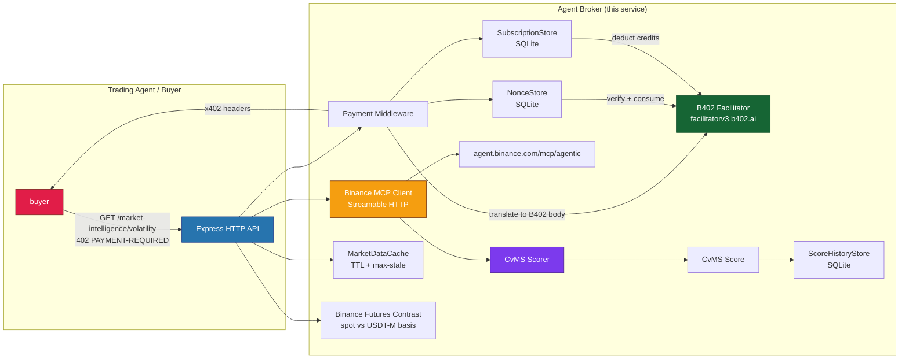

# Agent Broker

[](https://github.com/OWNER/REPO/actions/workflows/ci.yml)

HTTP **market-intelligence broker** for trading agents. Ingests market signals via Binance MCP, computes Composite Volatility & Momentum Scores (CVMS), and sells structured intelligence to other agents via HTTP 402 / B402 micropayments on BNB Chain.

## Who it is for

Autonomous or assisted trading agents that need priced, provenance-tagged volatility and portfolio-risk features. Also useful for developers building agent ecosystems who want to see a production-grade x402/B402 payment integration as a reference implementation.

## Architecture overview



### Stack

| Layer           | Technology                                                   |
| --------------- | ------------------------------------------------------------ |
| Runtime         | Node.js 22 + TypeScript                                      |
| HTTP framework  | Express.js 5                                                 |
| MCP client      | `@modelcontextprotocol/sdk` (Streamable HTTP)                |
| Payments        | x402 V2 / B402 Relayer (EIP-712 `TransferWithAuthorization`) |
| Facilitator     | B402 facilitator REST (`https://facilitatorv3.b402.ai`)      |
| Data stores     | SQLite (better-sqlite3) — 5 stores, no external deps         |
| Secondary venue | Binance futures (spot vs USDT-M basis; soft-fail contrast)   |
| OpenAPI serve   | `docs/openapi.yaml` served as YAML + JSON                    |
| Logging         | consola (structured)                                         |
| Testing         | Vitest (320+ tests)                                          |
| Linting         | ESLint (flat config) + Prettier                              |

### Network

| Constant          | Value                                             |
| ----------------- | ------------------------------------------------- |
| CAIP-2            | `eip155:56` / facilitator name `bsc`              |
| USDT              | `0x55d398326f99059fF775485246999027B3197955` (18) |
| USDC              | `0x8AC76a51cc950d9822D68b83fE1Ad97B32Cd580d` (18) |
| RelayerV3         | `0xE91b564EB8DFF305Ff8efA332f84c487b9da5171`      |
| Price per request | 0.05 USDT (`50000000000000000` atomic, 18 dec)    |

## Quick start

```bash
# 1. Install dependencies
npm install

# 2. Configure environment
cp .env.example .env
# Edit .env: set ADMIN_API_KEY, BINANCE_MCP_AUTH_TOKEN, B402_PAY_TO

# 3. Validate
npm run typecheck
npm test
npm run lint

# 4. Run locally
npm run dev          # tsx watch mode on http://localhost:3000
# or
npm run build && npm start  # compiled output
```

Default listen address: `http://localhost:3000`.

## CVMS scoring

The Composite Volatility & Momentum Score combines three signals:

- **Volatility score** — Standard deviation of log returns from candle closes, scaled to daily, normalized against a threshold (`volatilityMax`, default 10%). Range: 0–100.
- **Momentum score** — `50 + 25 * orderBookImbalance + 25 * normalizedPriceDirection`. Order book imbalance is `(bid_qty - ask_qty) / (bid_qty + ask_qty)` over the top N levels. Price direction is normalized price change over the threshold. Range: 0–100.
- **Open interest score** — Log-scale normalization `50 + 50 * clamp(0, 1, log10(OI)/10)`. Defaults to neutral 50 when no OI data. Range: 0–100.

Composite is weighted: `w_v * volScore + w_m * momScore + w_f * oiScore` (default 0.4 / 0.4 / 0.2), renormalized to volatility + momentum only when no OI data is present.

Each score includes provenance: `sources`, `data_age_ms`, `confidence_score` (freshness + completeness), and `stale` flag when served from cache past the TTL.

## Free discovery routes

| Route                      | Purpose                                                      |
| -------------------------- | ------------------------------------------------------------ |
| GET `/health`              | Liveness + dependency checks (MCP, facilitator, DB)          |
| GET `/api/v1/ready`        | Readiness: MCP connection + B402 facilitator reachability    |
| GET `/api/v1/agent/info`   | Machine-readable product catalog (pricing, payment metadata) |
| GET `/api/v1/openapi.yaml` | OpenAPI 3 spec (YAML)                                        |
| GET `/api/v1/openapi.json` | OpenAPI 3 spec (JSON)                                        |

## Paid intelligence (x402 / B402)

| Route                                         | Price                           |
| --------------------------------------------- | ------------------------------- |
| GET `/market-intelligence/volatility`         | 0.05 USDT                       |
| GET `/market-intelligence/volatility/history` | 0.01 USDT/record, min 1         |
| POST `/market-intelligence/volatility/batch`  | 0.04 USDT/symbol                |
| POST `/market-intelligence/portfolio/risk`    | 0.04 USDT/symbol                |
| POST `/subscription`                          | 10 USDT for credits (200 / 24h) |

Unauthenticated paid calls receive `402 Payment Required` with a base64 `PAYMENT-REQUIRED` header. Valid payments are verified and settled via the B402 facilitator before intelligence is returned with a base64 `PAYMENT-RESPONSE` header. Paid JSON includes a disclaimer and provenance metadata. Volatility and batch/portfolio responses may include soft-fail secondary-venue contrast via Binance futures basis.

Rate limiting (10 req/min per IP) runs before the 402 challenge. Admin treasury endpoints require `x-api-key` (`ADMIN_API_KEY`).

## Security highlights

- **Atomic nonce consume** — SQLite claims nonces before async facilitator calls (no TOCTOU double-spend).
- **Rate limit before 402** — Throttle runs before minting challenges / nonces.
- **Treasury controls** — Active flag, token whitelist, destination whitelist, single + daily limits.
- **Subscription farming fixes** — `POST /api/v1/subscription` requires real x402 payment; existing balance cannot buy a new sub.
- **Adversarial tests** — Audit suites cover replay, validation, batch DoS caps, subscription abuse, payment field binding.

See [docs/security.md](docs/security.md) for the full threat model.

## Subscription UX

Purchase via `POST /api/v1/subscription` (real payment only). Response returns `subscription_nonce`, `initial_balance`, `remaining_balance`, `expires_at`. Reuse the nonce in `payment-signature` on paid routes; each success deducts one credit and returns `remaining_balance` in the `PAYMENT-RESPONSE` header. See `/api/v1/agent/info` → `payment.subscription` for anti-farming rules.

## Multi-venue contrast

Binance MCP remains primary. Optional secondary-venue contrast via Binance USDT-M futures book-ticker vs spot mid:

| Env                          | Default | Meaning                                   |
| ---------------------------- | ------- | ----------------------------------------- |
| `SECONDARY_VENUE_ENABLED`    | `true`  | Set false to disable contrast fetches     |
| `SECONDARY_VENUE_TIMEOUT_MS` | 5000    | Fetch timeout for the futures book-ticker |

Contrast failures are soft: paid Binance-backed responses still succeed; `contrast.available` may be `false` or the field omitted.

## MCP client

`BinanceMcpClient` defaults to `https://agent.binance.com/mcp/agentic`. Inject a custom `McpClientLike` via `clientFactory` for tests. The MCP server requires browser-based authentication (Binance login + OAuth scopes); without auth the endpoint returns HTTP 404/empty. Market tools are discovered by name from `listTools` — ticker, klines, and order-book are required; open interest and funding rate are optional.

## Docs

- [Architecture](docs/architecture.md) — component diagram, data flow, data models
- [API](docs/api.md) — full API reference, request/response schemas
- [Payments](docs/payments.md) — x402/B402 payment flow, header format, subscription flow
- [Operations](docs/operations.md) — deployment, env config, monitoring, runbooks
- [Security](docs/security.md) — threat model, controls, audit summaries
- [OpenAPI](docs/openapi.yaml) — machine-readable API spec

## CI

GitHub Actions (`.github/workflows/ci.yml`) on push/PR to main: `npm ci`, typecheck, lint, test (with test env vars), build (Node 22).

## Payments mode

`PAYMENTS_ENABLED=false` or atomic price `0` skips 402/facilitator calls — the middleware serves data directly with a free-mode `PAYMENT-RESPONSE` receipt. `agent/info` reports `payments_enabled: false` and zero prices. The seller wallet is `B402_PAY_TO` (never the relayer contract `B402_RELAYER`).
