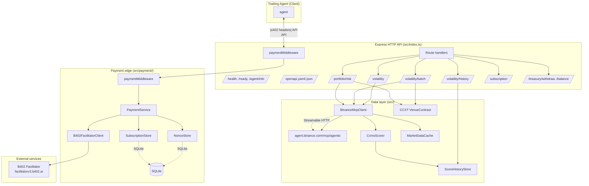
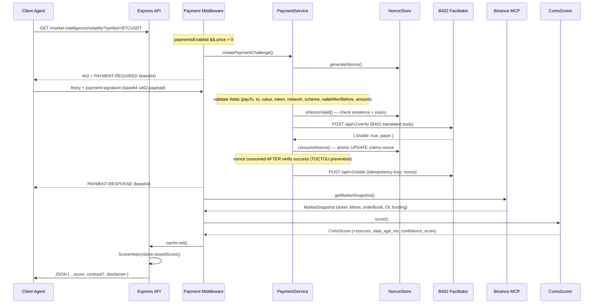
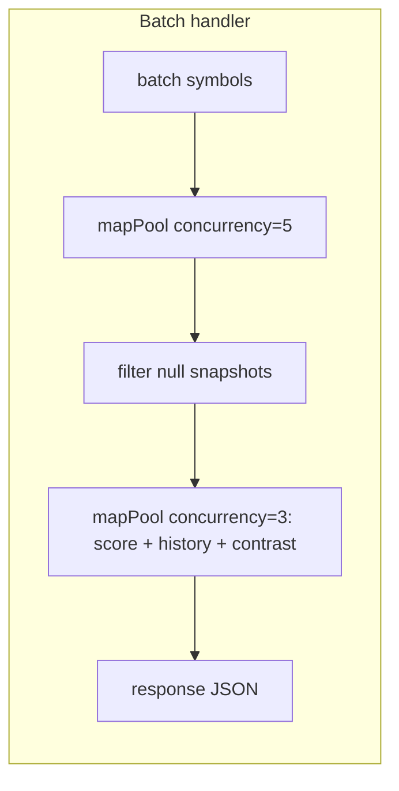
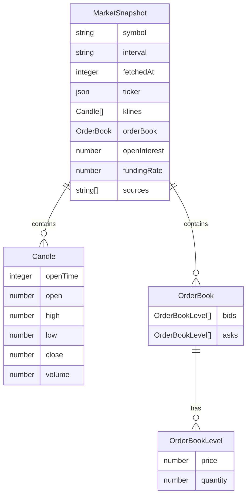
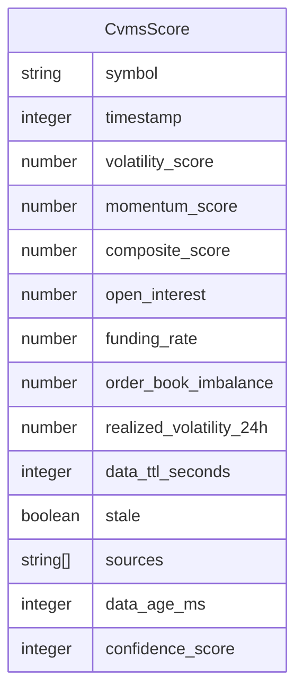
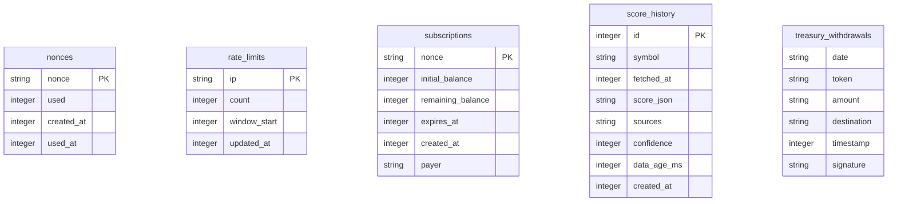

# Architecture

Agent Broker is an HTTP service that turns Binance market data into paid Composite Volatility & Momentum Scores (CVMS) for trading agents. It sits between a market-data source (Binance MCP) and downstream trading agents that need priced, provenance-tagged intelligence.

## Component diagram

## Layer responsibilities

| Layer              | Role                                                                       | Key files                                              |
| ------------------ | -------------------------------------------------------------------------- | ------------------------------------------------------ |
| Express routes     | Discovery, readiness, paid intelligence, admin treasury                    | `src/index.ts`                                         |
| Payment middleware | x402 V2 header I/O; rate-limit before challenge; subscription bypass       | `src/payment/middleware.ts`                            |
| Payment service    | Challenge creation, payment verification (field binding), settlement       | `src/payment/payment-service.ts`                       |
| B402 facilitator   | REST client: `/api/v1/verify`, `/api/v1/settle`, `/api/v1/health`          | `src/payment/b402-client.ts`                           |
| MCP client         | Streamable HTTP to Binance MCP (ticker, klines, book, optional OI/funding) | `src/mcp-client.ts`                                    |
| CVMS scorer        | Volatility, momentum/imbalance, open-interest contribution                 | `src/cvms.ts`                                          |
| Market cache       | Soft TTL (30s) + hard max-stale age (900s), 100-entry LRU eviction         | `src/market-cache.ts`                                  |
| Venue contrast     | Optional CCXT mid vs Binance basis                                         | `src/venue-contrast.ts`                                |
| SQLite stores      | Nonces, subscriptions, history, treasury, rate limits                      | `src/payment/*`-store.ts, `src/score-history-store.ts` |

## Data flow

### Batch/portfolio concurrency

## Data models

### MarketSnapshot

### CvmsScore

## SQLite store schemas

## Seller vs relayer

- **`B402_PAY_TO`** — seller wallet address. Challenge `payTo` and authorization `to` must match this. Required in production when payments are enabled.
- **`B402_RELAYER`** — relayer contract address (`0xE91b564EB8DFF305Ff8efA332f84c487b9da5171`). Used only as the EIP-712 `verifyingContract` / `relayerContract`. Never used as `payTo`.

## Free mode

`PAYMENTS_ENABLED=false` or atomic price `0` skips 402 entirely and the facilitator is never called. The middleware issues a free-mode `PAYMENT-RESPONSE` receipt and calls `next()`. `agent/info` reports `payments_enabled: false` and zero prices.
