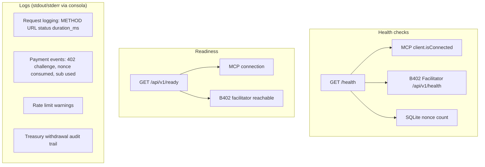
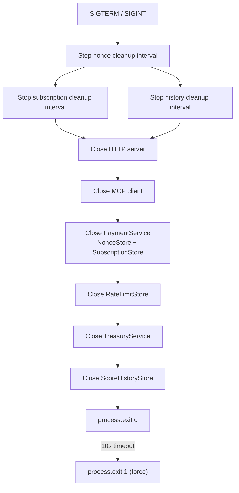

# Operations

## Requirements

- Node.js 22+
- npm 10+

## Quick start

```bash
# 1. Clone and install
git clone <repo>
cd agent-broker
npm install

# 2. Configure environment
cp .env.example .env
# Edit .env with your values

# 3. Validate
npm run typecheck
npm test

# 4. Run
npm run dev          # development (tsx watch)
# or
npm run build        # compile to dist/
npm start            # production
```

Default listen: `http://localhost:3000`.

## Environment variables

### Required at startup

The server exits with an error if these are missing.

| Variable                 | Description                                        | Example                       |
| ------------------------ | -------------------------------------------------- | ----------------------------- |
| `ADMIN_API_KEY`          | Admin API key for treasury endpoints (timing-safe) | `use-a-long-random-string`    |
| `BINANCE_MCP_AUTH_TOKEN` | Bearer token for Binance MCP endpoint              | `your-binance-mcp-auth-token` |

### B402 payment configuration

| Variable                 | Default                                | Description                          |
| ------------------------ | -------------------------------------- | ------------------------------------ |
| `PAYMENTS_ENABLED`       | `true`                                 | Set `false` to skip 402/facilitator  |
| `B402_PAY_TO`            | `0x000...001` (non-prod) / `""` (prod) | Seller wallet (never the relayer)    |
| `B402_FACILITATOR_URL`   | `https://facilitatorv3.b402.ai`        | B402 facilitator REST base URL       |
| `B402_RELAYER`           | `0xE91b564E...`                        | Relayer contract (verifyingContract) |
| `B402_PRICE_ATOMIC`      | `50000000000000000` (0.05 USDT)        | Single-route price in atomic units   |
| `B402_PRICE_DECIMAL`     | `0.05`                                 | Single-route price in decimal form   |
| `B402_VALIDITY_WINDOW`   | `3600`                                 | Nonce validity window (seconds)      |
| `B402_RATE_LIMIT_MAX`    | `10`                                   | Max requests per window per IP       |
| `B402_RATE_LIMIT_WINDOW` | `60`                                   | Rate limit window (seconds)          |

### Treasury controls

| Variable                     | Default                          | Description                             |
| ---------------------------- | -------------------------------- | --------------------------------------- |
| `B402_TREASURY_ACTIVE`       | `true`                           | Enable/disable treasury withdrawals     |
| `B402_TREASURY_DAILY_LIMIT`  | `10000000000000000000` (10 USDT) | Max withdrawal per day per token        |
| `B402_TREASURY_SINGLE_LIMIT` | `1000000000000000000` (1 USDT)   | Max single withdrawal per token         |
| `B402_WITHDRAWAL_WHITELIST`  | `0x000...001`                    | Comma-separated allowed destinations    |
| `B402_TOKEN_WHITELIST`       | USDT + USDC addresses            | Comma-separated allowed token addresses |

### Pricing (variable per-route)

| Variable                          | Default            | Description                        |
| --------------------------------- | ------------------ | ---------------------------------- |
| `B402_PRICING_HISTORY_PER_RECORD` | `0.01 USDT` atomic | Per-history-record price           |
| `B402_PRICING_HISTORY_MIN`        | `1 USDT` atomic    | History endpoint minimum charge    |
| `B402_PRICING_BATCH_PER_SYMBOL`   | `0.04 USDT` atomic | Per-symbol batch/portfolio price   |
| `B402_PRICING_SUBSCRIPTION`       | `10 USDT` atomic   | Subscription purchase price        |
| `B402_SUBSCRIPTION_REQUESTS`      | `200`              | Credits included per subscription  |
| `B402_SUBSCRIPTION_TTL`           | `86400` (24h)      | Subscription TTL (seconds, max 7d) |

### Server configuration

| Variable        | Default    | Description                                         |
| --------------- | ---------- | --------------------------------------------------- |
| `PORT`          | `3000`     | Listen port                                         |
| `NODE_ENV`      | —          | Set `production` for prod mode                      |
| `DATABASE_PATH` | `:memory:` | SQLite path (use file path in production)           |
| `TRUST_PROXY`   | `false`    | Read `X-Forwarded-For` for client IP                |
| `CORS_ORIGINS`  | —          | Comma-separated allowed origins (preflight support) |

### Market data / secondary venue

| Variable                         | Default | Description                             |
| -------------------------------- | ------- | --------------------------------------- |
| `MARKET_CACHE_MAX_STALE_SECONDS` | `900`   | Hard cap on stale cache serving         |
| `MCP_CONCURRENCY`                | `5`     | Max concurrent MCP fetches for batch    |
| `SECONDARY_VENUE_ENABLED`        | `true`  | Enable/disable Binance futures contrast |
| `SECONDARY_VENUE_TIMEOUT_MS`     | `5000`  | Fetch timeout for futures book-ticker   |

## Deployment

### Docker (recommended for production)

```dockerfile
FROM node:22-alpine AS builder
WORKDIR /app
COPY package*.json ./
RUN npm ci --omit=dev
COPY . .
RUN npm run build

FROM node:22-alpine
WORKDIR /app
COPY --from=builder /app/dist ./dist
COPY --from=builder /app/node_modules ./node_modules
COPY --from=builder /app/docs ./docs
EXPOSE 3000
CMD ["node", "dist/src/index.js"]
```

A `render.yaml` is included for Render.com Docker deploy (free tier). On free tier the filesystem is ephemeral, so prefer `DATABASE_PATH=:memory:` (or accept SQLite data loss on restart).

### Production env

```bash
export NODE_ENV=production
export DATABASE_PATH=/data/agent-broker.sqlite
export ADMIN_API_KEY=$(openssl rand -hex 32)
export B402_PAY_TO=0xYourSellerWallet
export BINANCE_MCP_AUTH_TOKEN=your-mcp-token
export TRUST_PROXY=true
export CORS_ORIGINS=https://your-frontend.com
```

## Monitoring



| Probe           | URL                      | Healthy response                  | Unhealthy response                 |
| --------------- | ------------------------ | --------------------------------- | ---------------------------------- |
| Liveness        | `GET /health`            | 200 `{ ok: true, checks: [...] }` | 503 `{ ok: false, checks: [...] }` |
| Readiness       | `GET /api/v1/ready`      | 200 `{ ready: true, checks: {} }` | 503 `{ ready: false, checks: {} }` |
| Product catalog | `GET /api/v1/agent/info` | 200 product info JSON             | n/a (always available)             |

## CI/CD

GitHub Actions (`.github/workflows/ci.yml`) runs on push/PR to `main`:

1. Checkout
2. Setup Node.js 22
3. Install build tools (better-sqlite3 native deps)
4. `npm ci`
5. `npm run typecheck`
6. `npm run lint`
7. `npm test` (with test env vars)
8. `npm run build`

Test environment variables set in CI:

- `ADMIN_API_KEY: ci-test-admin-key`
- `BINANCE_MCP_AUTH_TOKEN: ci-test-mcp-token`
- `B402_PAY_TO: "0x0000000000000000000000000000000000000001"`
- `PAYMENTS_ENABLED: "true"`
- `NODE_ENV: test`

## Graceful shutdown

The server handles `SIGTERM` and `SIGINT`:



## Runbooks

### MCP connection fails

1. Check `GET /health` — MCP check shows `"fail", "MCP client is not connected"`
2. Verify `BINANCE_MCP_AUTH_TOKEN` is set and valid
3. Check Binance MCP endpoint availability at `https://agent.binance.com/mcp/agentic`
4. Paid routes will serve stale cached data (if available) or return 503

### Payment verification fails

1. Check facilitator health: `GET /health` shows facilitator status
2. Verify `B402_PAY_TO` matches the `payTo` in the client's payment payload
3. Verify `B402_RELAYER` matches the relayer contract
4. Check that the payment signature is valid EIP-712 `TransferWithAuthorization`
5. Ensure the nonce hasn't expired (3600s default window)

### Rate limited (429)

1. Check `Retry-After` header for reset time
2. Rate limit is per-IP: `B402_RATE_LIMIT_MAX` requests per `B402_RATE_LIMIT_WINDOW` seconds
3. Rate limit check runs **before** 402 challenge — exceeded IPs never mint nonces
4. Consider increasing limits via env vars for high-traffic deployments

### Treasury withdrawal rejected

1. Check `tokenWhitelist` — token must be USDT or USDC contract address
2. Check `withdrawalWhitelist` — destination must be in the allowed list
3. Check daily limit — `B402_TREASURY_DAILY_LIMIT`
4. Check single limit — `B402_TREASURY_SINGLE_LIMIT`
5. Check treasury active flag — `B402_TREASURY_ACTIVE`
