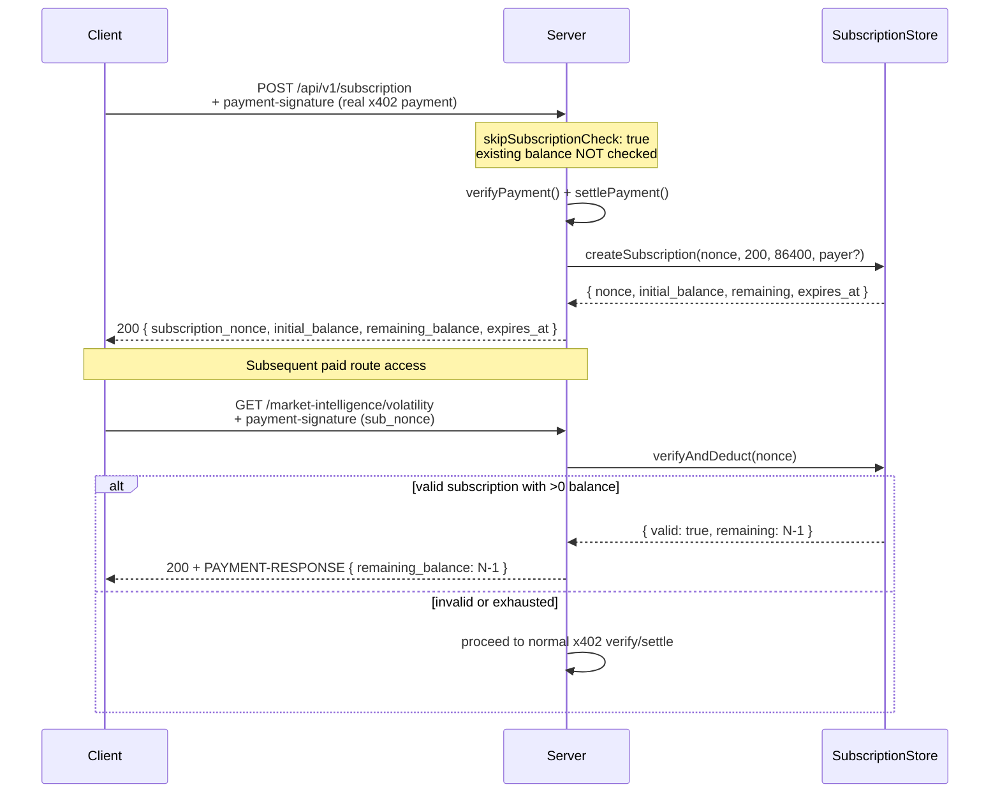

# Payments (B402 / x402)

Clients interact with the broker using x402 V2 HTTP headers. At the facilitator edge, the broker translates x402 payloads into the live B402 facilitator JSON shape.

```mermaid
graph TD
    C[Client Agent]
    S[Express Server]
    F[B402 Facilitator<br/>facilitatorv3.b402.ai]

    C -->|1. GET paid route (no payment-sig)| S
    S -->|2. 402 + PAYMENT-REQUIRED (base64)| C
    C -->|3. Retry + payment-signature (base64 x402)| S
    S -->|4. translate to B402 body| F
    F -->|5. verify| F
    F -->|6. settle| F
    S -->|7. 200 + PAYMENT-RESPONSE (base64)| C
```

## x402 V2 header flow

### Step 1: Challenge (no payment)

Client calls a paid route without a `payment-signature` header.

**Response:** `402 Payment Required`

**Headers:**

- `PAYMENT-REQUIRED`: base64-encoded `PaymentRequired` object

**PaymentRequired structure:**

```json
{
  "x402Version": 2,
  "resource": {
    "url": "http://localhost:3000/api/v1/market-intelligence/volatility?symbol=BTCUSDT",
    "description": "Single-symbol CVMS volatility & momentum score",
    "mimeType": "application/json"
  },
  "accepts": [
    {
      "scheme": "exact",
      "network": "eip155:56",
      "asset": "0x55d398326f99059fF775485246999027B3197955",
      "payTo": "0xYourSellerWalletHere",
      "amount": "50000000000000000",
      "maxTimeoutSeconds": 3600,
      "extra": {
        "name": "B402",
        "version": "1",
        "chainId": 56,
        "verifyingContract": "0xE91b564EB8DFF305Ff8efA332f84c487b9da5171",
        "relayerContract": "0xE91b564EB8DFF305Ff8efA332f84c487b9da5171",
        "assetTransferMethod": "b402-relayer",
        "token": "0x55d398326f99059fF775485246999027B3197955",
        "typedDataIncludesToken": true,
        "nonce": "0x...",
        "validAfter": 1234567890,
        "validBefore": 1234571490
      }
    },
    {
      "scheme": "exact",
      "network": "eip155:56",
      "asset": "0x8AC76a51cc950d9822D68b83fE1Ad97B32Cd580d",
      "payTo": "0xYourSellerWalletHere",
      "amount": "50000000000000000",
      "maxTimeoutSeconds": 3600,
      "extra": { ... same structure with USDC token ... }
    }
  ]
}
```

Both USDT and USDC are accepted at the same price. The `extra.nonce` is a server-generated random 32-byte hex value stored in `NonceStore`. `extra.validAfter`/`validBefore` define the challenge validity window (default 3600s).

### Step 2: Sign and pay

Client signs a B402 Relayer EIP-712 `TransferWithAuthorization` message and sends it as the `payment-signature` header (base64).

**PaymentPayload structure (x402):**

```json
{
  "x402Version": 2,
  "resource": { "url": "...", "description": "..." },
  "accepted": {
    "scheme": "exact",
    "network": "eip155:56",
    "asset": "0x55d398326f99059fF775485246999027B3197955",
    "payTo": "0xYourSellerWalletHere",
    "amount": "50000000000000000",
    "extra": { "nonce": "0x...", "validAfter": 1234567890, "validBefore": 1234571490 }
  },
  "payload": {
    "signature": "0xsignature...",
    "authorization": {
      "from": "0xBuyerAddress",
      "to": "0xYourSellerWalletHere",
      "value": "50000000000000000",
      "validAfter": "1234567890",
      "validBefore": "9999999999",
      "nonce": "0x...",
      "token": "0x55d398326f99059fF775485246999027B3197955"
    }
  }
}
```

### Step 3: Server verification

The server validates payment fields **before** calling the facilitator:

```mermaid
graph TD
    A[PaymentPayload received] --> B{x402Version == 2?}
    B -->|no| C[reject: invalid_x402_version]
    B -->|yes| D{payTo == B402_PAY_TO?}
    D -->|no| E[reject: payTo_mismatch]
    D -->|yes| F{accepted.amount == expected?}
    F -->|no| G[reject: invalid_amount]
    F -->|yes| H{network matches?}
    H -->|no| I[reject: network_mismatch]
    H -->|yes| J{scheme == "exact"?}
    J -->|no| K[reject: invalid_scheme]
    J -->|yes| L{is TWA payload?}
    L -->|no| M[reject: invalid_payment_payload]
    L -->|yes| N{validAfter/Before in window?}
    N -->|no| O[reject: authorization_not_yet_valid / expired]
    N -->|yes| P{auth.value == expected?}
    P -->|no| Q[reject: authorization_value_mismatch]
    P -->|yes| R{auth.to == seller?}
    R -->|no| S[reject: authorization_to_mismatch]
    R -->|yes| T{auth.token == asset?}
    T -->|no| U[reject: authorization_token_mismatch]
    T -->|yes| V{nonce valid & unused?}
    V -->|no| W[reject: nonce_unknown / reused / expired]
    V -->|yes| X[facilitator.verify()]
    X -->|valid| Y[consumeNonce - atomic consume]
    Y --> Z[facilitator.settle + Idempotency-Key]
```

Key ordering rules:

1. All field binding checks run **before** `consumeNonce` (fail-fast, no nonce consumed on invalid fields)
2. `consumeNonce` runs **after** successful facilitator `verify` (TOCTOU prevention — nonce consumed only after signature is confirmed valid)
3. Nonce consumed via atomic SQLite `UPDATE ... WHERE nonce=? AND used=0 AND created_at > ?` — concurrent requests cannot both succeed
4. `settle` includes `Idempotency-Key: <nonce>` header for retry safety

## B402 facilitator translation

The x402 client payload is translated at the edge to the live B402 facilitator REST API:

```mermaid
graph LR
    A[x402 PaymentPayload] --> B[translate]
    B --> C[B402FacilitatorRequest]

    subgraph "B402 Facilitator Request Body"
        C --> D[paymentPayload.token]
        C --> E[paymentPayload.payload.signature]
        C --> F[paymentPayload.payload.authorization.from]
        C --> G[paymentPayload.payload.authorization.to]
        C --> H[paymentPayload.payload.authorization.value]
        C --> I[paymentPayload.payload.authorization.validAfter]
        C --> J[paymentPayload.payload.authorization.validBefore]
        C --> K[paymentPayload.payload.authorization.nonce]
        C --> L[paymentRequirements.network: "bsc"]
        C --> M[paymentRequirements.relayerContract: "0x..."]
    end
```

**CAIP-2 mapping:** `eip155:56` → facilitator network `bsc`.

**Facilitator endpoints:**

| Method | Path             | Purpose                                 |
| ------ | ---------------- | --------------------------------------- |
| POST   | `/api/v1/verify` | Verify signature + authorization        |
| POST   | `/api/v1/settle` | Execute transfer (with idempotency key) |
| GET    | `/api/v1/health` | Liveness probe (3s timeout, 3 retries)  |

## EIP-712 domain

The B402 Relayer uses EIP-712 typed data with this domain:

```json
{
  "name": "B402",
  "version": "1",
  "chainId": 56,
  "verifyingContract": "0xE91b564EB8DFF305Ff8efA332f84c487b9da5171"
}
```

The typed data payload includes the `token` address field (`typedDataIncludesToken: true`), making this a B402 Relayer `TransferWithAuthorization` — **not** native token EIP-3009.

## Network & tokens

| Network   | CAIP-2      | Facilitator | Chain ID |
| --------- | ----------- | ----------- | -------- |
| BNB Chain | `eip155:56` | `bsc`       | 56       |

| Token | Address                                      | Decimals |
| ----- | -------------------------------------------- | -------- |
| USDT  | `0x55d398326f99059fF775485246999027B3197955` | 18       |
| USDC  | `0x8AC76a51cc950d9822D68b83fE1Ad97B32Cd580d` | 18       |

## Pricing

| Route        | Price                         | Env override                                                  |
| ------------ | ----------------------------- | ------------------------------------------------------------- |
| Single route | 0.05 USDT                     | `B402_PRICE_ATOMIC`                                           |
| History      | 0.01 USDT/record (min 1 USDT) | `B402_PRICING_HISTORY_PER_RECORD`, `B402_PRICING_HISTORY_MIN` |
| Batch        | 0.04 USDT/symbol              | `B402_PRICING_BATCH_PER_SYMBOL`                               |
| Subscription | 10 USDT                       | `B402_PRICING_SUBSCRIPTION`                                   |

All prices are in atomic units (18 decimals). Price `0` or `PAYMENTS_ENABLED=false` skips 402 for that route.

## Subscription flow



**Anti-farming:** `POST /api/v1/subscription` uses `skipSubscriptionCheck: true` and charges a real x402 payment. Existing subscription balance cannot be spent on the subscription endpoint itself.

**Bearer credit security note:** Subscription credits are presented as a bearer nonce. When the settle response includes a `payer`, the nonce is bound to that address; subsequent presentations should include `authorization.from` matching the payer. Treat leaked nonces as spendable credits.

## Free mode

`PAYMENTS_ENABLED=false` or atomic price `0`: the middleware skips the 402 challenge entirely, issues a free-mode `PAYMENT-RESPONSE` receipt, and calls `next()` to serve data. No facilitator calls are made. `agent/info` reports `payments_enabled: false` and zero prices.

## Residual / limitations

- Post-settle MCP outage can still return 503 without refund (no escrow/refund mechanism)
- Validation failures are rejected **before** payment is charged
- `resource.url` uses unvalidated Host header (informational only, not verified server-side)
