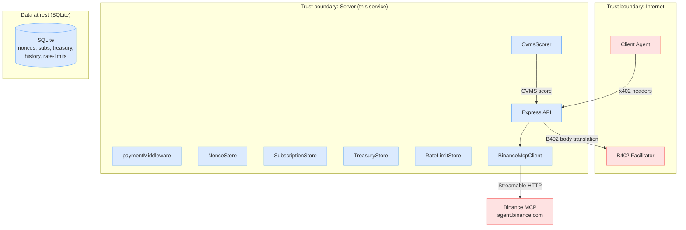
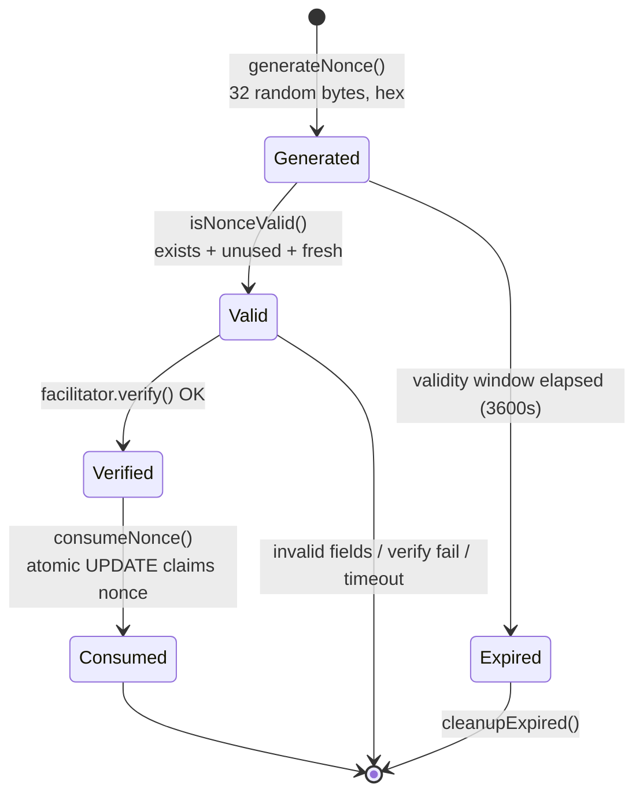
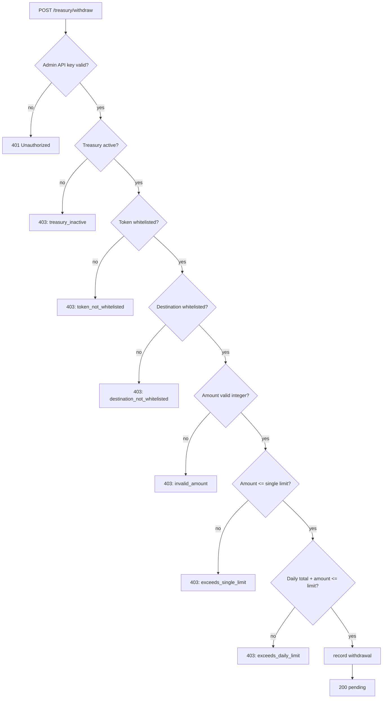
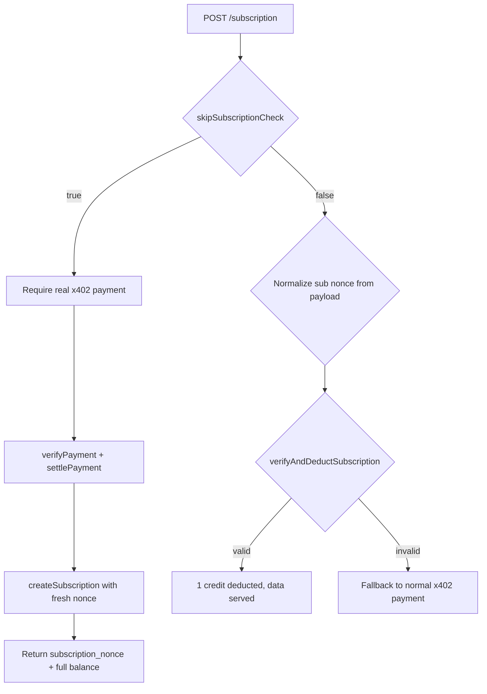

# Security

## Threat model

**Trust boundaries:**

- **Outside:** Client agents, B402 facilitator, Binance MCP endpoint — all untrusted network endpoints
- **Inside (server):** Express app, all stores, payment middleware, MCP client, CVMS scorer
- **Data at rest:** SQLite database file on the local filesystem

## Payment security controls

### 1. Nonce lifecycle (replay protection)

Key invariants:

- `consumeNonce` uses atomic SQLite `UPDATE ... WHERE nonce=? AND used=0 AND created_at > ?` — concurrent requests cannot double-spend (no TOCTOU race)
- Nonce is consumed **after** `facilitator.verify` succeeds, **not** before — if the facilitator is unreachable, the nonce remains available
- Nonce is also the `Idempotency-Key` for `settle` — retry-safe
- 256-character maximum nonce length enforced (EIP-3009 standard)

### 2. Payment field binding

Server validates all fields **before** calling the facilitator:

| Field                 | Check                                       | Fail reason                    |
| --------------------- | ------------------------------------------- | ------------------------------ |
| `x402Version`         | Must be `2`                                 | `invalid_x402_version`         |
| `accepted`            | Must exist as object                        | `missing_payment_requirements` |
| `accepted.asset`      | Must be USDT or USDC contract address       | `token_not_accepted`           |
| `accepted.amount`     | Must match computed price                   | `invalid_amount`               |
| `accepted.payTo`      | Must equal `B402_PAY_TO` (seller)           | `payTo_mismatch`               |
| `accepted.network`    | Must match `eip155:56`                      | `network_mismatch`             |
| `accepted.scheme`     | Must be `"exact"`                           | `invalid_scheme`               |
| `authorization.value` | Must equal expected amount (BigInt compare) | `authorization_value_mismatch` |
| `authorization.to`    | Must equal seller                           | `authorization_to_mismatch`    |
| `authorization.token` | Must match `asset` if present               | `authorization_token_mismatch` |
| `validAfter`          | Must be finite; `now >= validAfter`         | `authorization_not_yet_valid`  |
| `validBefore`         | Must be finite; `now <= validBefore`        | `authorization_expired`        |

### 3. Timing-safe comparisons

- Admin API key uses `crypto.timingSafeEqual` (via `safeApiKeyCompare`)
- All string comparisons for addresses use normalized lowercase comparison

## Abuse prevention controls

### 4. Rate limiting (before 402)

- SQLite-backed sliding window: `B402_RATE_LIMIT_MAX` (default 10) requests per `B402_RATE_LIMIT_WINDOW` (default 60s) per IP
- Check runs **before** issuing a 402 challenge — rate-limited IPs never mint nonces
- Returns `429` with `Retry-After` header (never negative)

### 5. Input validation (before payment)

- **Symbols:** regex `^[A-Za-z0-9]{3,20}$`, deduplicated, capped at 100 (`MAX_BATCH_SYMBOLS`)
- **Intervals:** regex `\d+[mhdw]`, quantity >= 1 (rejects `0m`)
- **Kline limit:** integer 1–1000
- **Portfolio weights:** finite non-negative numbers; same length as symbols
- **Body size:** `express.json({ limit: "10kb" })` — returns 413 on overflow

### 6. MCP concurrency cap

- Batch/portfolio fetches limited to `MCP_CONCURRENCY` (default 5) via `mapPool`
- Contrast fetches also concurrency-limited

### 7. Cache max-stale age

- `MarketDataCache` hard cap: never serves cache older than `maxStaleAgeSeconds` (default 900s / 15 min)
- Stale entries evicted on each `set()` to prevent cache flooding
- Max 100 entries with FIFO eviction

### 8. Treasury controls

### 9. Subscription anti-farming

- `POST /api/v1/subscription` uses `skipSubscriptionCheck: true` — existing subscription balance **cannot** buy a new subscription
- Each paid route access deducts exactly 1 credit atomically (SQLite)
- Expired/empty subscriptions fall through to normal x402 payment

## Network security

- **Security headers** set on all responses:
  - `X-Content-Type-Options: nosniff`
  - `X-Frame-Options: DENY`
  - `Strict-Transport-Security: max-age=31536000; includeSubDomains`
  - `Content-Security-Policy: default-src 'none'`
- **CORS:** Configurable origin allowlist via `CORS_ORIGINS`; disabled by default (secure)
- **Trust proxy:** `TRUST_PROXY=true` to read `X-Forwarded-For` behind load balancers
- **No secrets in URLs:** Headers only (`x-api-key`, `payment-signature`)

## Audit history

All findings from adversarial audit passes are remediated. See documentation under `docs/audit-report.md` (when present) for the full registry. Key findings fixed:

| Severity | Finding                                                              | Status                             |
| -------- | -------------------------------------------------------------------- | ---------------------------------- |
| CRITICAL | B402 facilitator API path mismatch (`/verify` → `/api/v1/verify`)    | Fixed                              |
| CRITICAL | History cleanup unit mismatch (ms vs seconds wipes all records)      | Fixed                              |
| CRITICAL | Funding signal uses raw open interest, not funding rate              | Fixed (renamed to `open_interest`) |
| CRITICAL | Nonce consumed before facilitator success (wasted nonces on failure) | Fixed                              |
| HIGH     | settle retry can double-settle (missing idempotency key)             | Fixed                              |
| HIGH     | Portfolio score uses raw weights instead of normalized               | Fixed                              |
| HIGH     | Sequential CCXT calls in batch (DoS amplification)                   | Fixed (parallelized)               |
| MEDIUM   | No symbol deduplication (duplicate MCP calls)                        | Fixed                              |
| LOW      | `clamp` returns NaN for NaN input (fail-open)                        | Fixed (fail-closed)                |
| LOW      | `funding_rate_signal` could be Infinity (JSON null)                  | Fixed                              |
| LOW      | No max-length validation on nonce strings                            | Fixed (256 char limit)             |

## Residual / accepted risks

- **`resource.url` uses unvalidated Host header** — informational only, not verified server-side. Low impact.
- **Post-settle MCP outage can 503 without refund** — no escrow/refund mechanism. Validation failures are rejected before payment.
- **Admin endpoints share `RateLimitStore`** with payment endpoints — accepted by design.
- **No correlation IDs** — observability gap, not a security issue.
- **FIFO cache eviction instead of LRU** — no security impact.
